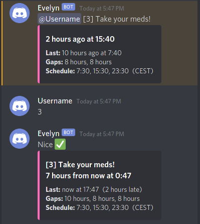
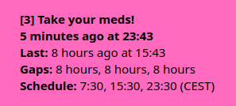

# Evelyn Reminder

**Server application with Discord bot and desktop client**

> **Warning**: This project is in alpha stage. There are the following issues:
>
> * The text bot commands to create new reminders and edit its attributes are not implemented yet. This means data in
>   the database needs to be edited manually for initial setup.
> * There is no user authentication. All users of an API server are able to view, edit and delete data of all other
>   users. The intended use case is, that one API server is only used by a few people who trust each other. You can
>   however configure an API key for your server to prevent public access.
> * All parts of this project are only available in English language.

> **Contents**
>
> 1. [Features](#features)
> 2. [Structure](#structure)
> 3. [Usage](#usage)
> 4. [How to run](#how-to-run)
> 5. [Update ideas](#update-ideas)
> 6. [License](#license)

## Features
### Discord bot

This Discord bot can send regular reminders, while maintain a fixed number of periods per day. It is build as a
medication reminder, specifically with [HRT](https://en.wikipedia.org/wiki/Transgender_hormone_therapy) medication in
mind, but the aim is to make it useful for lots of applications. It is very robust against delays introduced by the
user, trying to steer the timing back to the target schedule. It also supports registering multiple reminders for
multiple users within multiple servers.

* Send pings a fixed number times a day to a specific user
* Select time of final dose per day, other times are calculated accordingly
* Confirm each dose taken manually
* If necessary, automatically varies period length by a limited number of time to catch up
* Pings repeatedly if ignored
* Snooze pings for a fixed amount of time
* Optionally display of "left arm" and "right arm" alternating
* Custom response messages, emotes, and colors
* Use Discord's text-to-speech feature (when channel is selected)

### Desktop client

This is a complementary desktop application to display the status of your reminders. Click anywhere inside the window to
record a reminder as done. It only shows one reminder at a time, which is automatically selected by the smallest key. It
uses the background color which is assigned to the reminder. When no reminder is due, the window becomes transparent. In
summary, the application behaves like a permanent notification on your screen. It is recommended to place it on a
secondary monitor.

## Structure

**Blue:** These are external dependencies. You need a database, the [uWSGI](https://uwsgi-docs.readthedocs.io/)
application server, and a web server. The web server should be configured to serve the API over HTTPS. This manual will
not go into detail how to set up these external dependencies.

**Green:** These are modules which are part of this project.

Module | Description | Dependencies
--- | --- | ---
[evelyn_reminder.api](src/evelyn_reminder/api) | Core logic with database access and HTTP API | [Python](https://www.python.org/) 3.8 or 3.9, [Flask](https://flask.palletsprojects.com/), [SQLAlchemy](https://www.sqlalchemy.org/), [mysqlclient](https://github.com/PyMySQL/mysqlclient), [pytz](https://pythonhosted.org/pytz/)
[evelyn_reminder.client.bot.discord](src/evelyn_reminder/client/bot/discord) | Discord bot with full control | Python 3.8, [discord.py](https://discordpy.readthedocs.io/)
[evelyn_reminder.client.desktop](src/evelyn_reminder/client/desktop) | Desktop client with reminder display and mark as done | Python 3.8 or 3.9, [Qt](https://wiki.qt.io/Qt_for_Python)

### Privacy

This software is processing the following information. No data is sent to any third parties.

* All timestamps of completed reminders is saved in a database
* The bot has access to all messages in channels where read permission is granted. This is standard for Discord bots,
  and necessary to process commands. No messages are saved after commands are processed.

## Usage
### Discord bot

Each reminder gets assigned a number between 1 and 9, so each user can have up to 9 reminders. To execute a command that
is related to a specific reminder, it needs to start with the respective number.

Each reminder is linked to a specific channel in which the pings will appear. Commands related to the reminder will only
that channel. Commands that are not related to a specific reminder will work in every channel, so it is recommended to
restrict the bot to relevant channels using the Discord channel permission "Read Messages".

To create a new reminder, add a new row to the `reminder` database table. For possible timezones, see this
[list of tz database time zones](https://en.wikipedia.org/wiki/List_of_tz_database_time_zones#List), column "TZ database
name".

You then have the following commands available in Discord.

Command               | Description
--------------------- | ---
`help`                | Show this help
`?`                   | List your registered reminders \*
`all?`                | List registered reminders from all users
`1?`        | Show status of reminder 1 \*
`1`         | Record reminder 1 done \*
`1 42m`     | Record reminder 1 done 42 minutes ago \*\* \*
`1 del`     | Delete last record of reminder 1 \*
`1 13:37`             | Set time of last reminder of the day \*
`1 mute 3d` | Mute reminder 1 for 3 days \*\* \*
`1 unmute`  | Unmute reminder 1 \*

\*) append `@user` to execute for someone else  
\*\*) use one or more of: `m`in, `h`our, `d`ay, `w`eek, `M`onth, `y`ear  

### Desktop client

Context menu | Description
--- | ---
Report done ... | Select a time in the past, when you forgot to confirm the reminder
Exit | Close the application
Frameless window | Check this to hide the window border of your operating system

The window will remember its last position. To move it, uncheck "Frameless window" in the context menu. Afterwards you
can hide the frame again.

## How to run
### API server

Create a config file `settings.cfg`.

    DB_HOST = 'localhost'
    DB_NAME = 'evelyn_reminder'
    DB_USERNAME = 'evelyn_reminder'
    DB_PASSWORD = '0000'
    API_KEY = '0000'

For testing, you can run the module directly. You should not do this in a production deployment.

    $ cd src
    $ python -m evelyn_reminder.api settings.cfg

**Note:** Before the server can function, the tables need to be created in the database. To do this, in the method
`setup_database()` change the line `create_all = False` to `create_all = True` for one run.

To run the server in a production deployment, create the uWSGI file `uwsgi.ini`.

    [uwsgi]
    mount = /evelyn=evelyn_reminder.api:application
    manage-script-name = true
    pyargv = settings.cfg
    pidfile = evelyn_api.pid
    master = true
    processes = 1
    socket = :1024
    chmod-socket = 660
    vacuum = true

Finally, run the server using uWSGI.

    $ cd src
    $ ../venv/bin/uwsgi evelyn_reminder/api/uwsgi.ini

Set up your web server to make the application accessible.

    ProxyPass /evelyn uwsgi://localhost:1024/

#### API documentation

Path | Arguments | Method | Body | Response | Description
--- | --- | --- | --- | --- | ---
`/reminder` | `guild`, `[member]`, `[key]` | `GET` | --- | List of `ReminderResponse` objects | View existing reminders
`/reminder` | `guild`, `member`, `key` | `PUT` | Reminder attributes | --- | Create or update a reminder
`/reminder` | `guild`, `member`, `key` | `DELETE` | --- | --- | Remove an existing reminder
`/history` | `guild`, `member`, `key`, `[time_utc]` | `POST` | --- | `HistoryResponse` object | Record that a reminder is done
`/history` | `guild`, `member`, `key` | `DELETE` | --- | --- | Remove the last reminder done record
`/ping` | `[guild]`, `[member]`, `[key]`, `[filter_due]`, `[filter_muted]`, `[filter_ping_due]` | `GET` | --- | List of `PingResponse` objects | List all due pings
`/ping` | `guild`, `member`, `key` | `POST` | --- | --- | Record that a ping is done

Arguments with `[]` are optional. Additionally, each requests must include the `api_key` argument for authentication.

The arguments `guild`, `member` and `key` are integers. `time_utc` is a timestamp in
[ISO 8601](https://en.wikipedia.org/wiki/ISO_8601#Combined_date_and_time_representations) format and must include
timezone information. The `filter_*` arguments are either `true` or `false` and default to `true`.

Bodies and responses are JSON encoded and use the `application/json` content type header.

This is an example URL:

    /ping?guild=000000000000000000&member=000000000000000000&filter_ping_due=false&api_key=0000

### Discord bot

First you need to [set up a Discord bot](https://discord.com/developers/applications) and create an
[OAuth2 API token](https://discordapp.com/developers/docs/topics/oauth2).

The following permissions should be granted by invite:

* Send Messages
* Send TTS Messages
* Embed Links

An example invite link would look like this:

    https://discord.com/api/oauth2/authorize?client_id=000000000000000000&permissions=22528&scope=bot

The following permissions have to be granted by the user in a server:

* Read Text Channels & See Voice Channels (role or category permission)
* Read Messages (channel permission)

Then create a config file `config.ini`:

    [DEFAULT]
    evelyn_netloc = example.com
    evelyn_base_path = /evelyn
    evelyn_api_key = 0000
    discord_token = 0000

Execute the module:

    $ cd src
    $ python -m evelyn_reminder.client.bot.discord evelyn_reminder/client/bot/discord/config.ini

### Desktop client

Create a config file `config.ini`:

    [server]
    netloc = example.com
    base_path = /evelyn
    api_key = 0000
    
    [login]
    guild = 000000000000000000
    member = 000000000000000000
    
    [general]
    window_stays_on_top = yes

Execute the module. The config file is expected to be in the directory from where the app is executed, optionally you
can also specify its location with the `--config` parameter.

    $ cd src
    $ python -m evelyn_reminder.client.desktop [--config config.ini]

You can make one-file archive containing all code that is directly executable with a Python interpreter. Make sure there
are no config files with secret passwords anywhere in the `src` directory when you run the command, otherwise they are
included.

    $ python -m zipapp src --output=evelyn_desktop.pyzw --main=evelyn_reminder.client.desktop:main --compress

Then execute the file directly in your file explorer or with this command:

    $ python evelyn_desktop.pyzw [--config config.ini]

## Update ideas

### API server

(nothing)

### Discord bot

* Automatically delete, or update old pings in Discord
* Allow all settings of both the config and state file to be changed on the fly with bot commands on a per-user level,
  see [Usage Discord Bot Update](readme_files/usage_discord_bot_update.md)
* Mark multiple reminders done at once ("12")
* Custom reminder key (",")
* New command to generate history diagram of interval times
* Dynamic response messages based on delays from the user

### Matrix bot

* Implement a version of the bot for [Matrix](https://matrix.org/)

### Desktop client

* Right click to delete done reminder

## License

Evelyn Reminder  
Copyright © 2022 Stefan Schindler

This program is free software: you can redistribute it and/or modify it under the terms of the GNU General Public
License in version 3 as published by the Free Software Foundation.

This program is distributed in the hope that it will be useful, but WITHOUT ANY WARRANTY; without even the implied
warranty of MERCHANTABILITY or FITNESS FOR A PARTICULAR PURPOSE. See the GNU General Public License for more details.

You should have received a [copy of the GNU General Public License](LICENSE.md) along with this program. If not, see 
[https://www.gnu.org/licenses/](https://www.gnu.org/licenses/).
